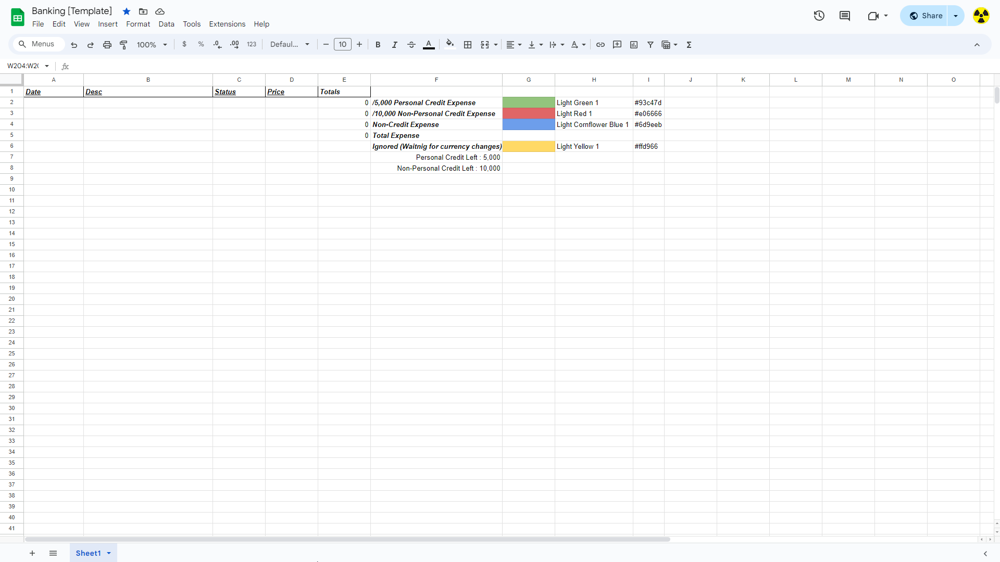
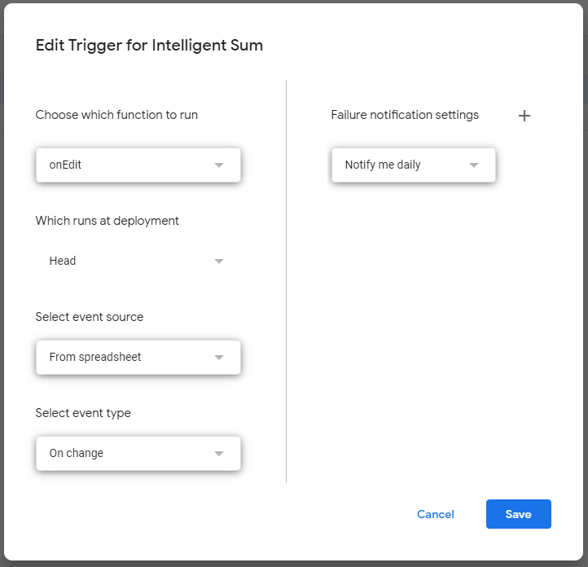

# Intelligent Sum for Google Sheets

## Introduction

This script was written for calculating personal expenses on a Google Sheets Document. Feel free to use it on your own personal work.

## Coloring
- Light Green 1  `#93c47d` for Personal Credit Expenses
- Light Red 1  `#e06666` for Non-Personal Credit Expenses
- Light Cornflower Blue 1  `#6d9eeb` for Non-Credit Expenses
- Light Yellow 1  `#ffd966` for expenses to be ignored (waiting for currency rate etc.)

## Calling the functions

When calling a function you must adjust the column and output values according to your own sheets document. Right not the script is configured for [Template Document](https://docs.google.com/spreadsheets/d/1pKk1RBE4a3gc1OTYceQn03y2ZDjADVl9eOfXdve_Vtk/edit?usp=sharing)



Script is configured to return the values in a specific column/cell. You must call the function in that specific cell in order to avoid an error as below
```
Exception: You do not have permission to call setValue (line 82)
```

## Setting up the triggers

On [Apps Script](https://script.google.com/home) after having created the project you must add 2 triggers for the script to work correctly

1. `onEdit` Trigger which calls the `onEdit(e)` function when a value is changed


2. `onChange` Trigger which calls the `onEdit(e)` function when a background is changed


